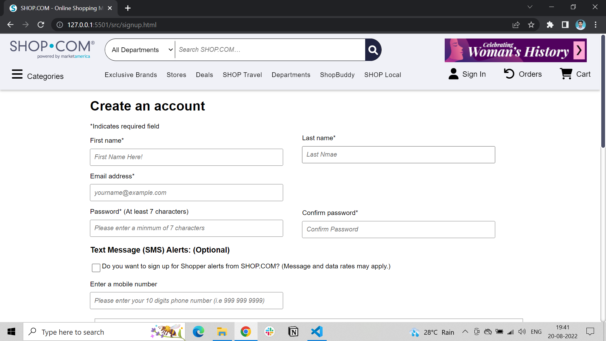

# “shop.com” Website Clone

### SHOP.COM is a new kind of shopping comparison site that offers the most comprehensive shopping experience on the web.

This is our first project at Masai School using JavaScript, HTML, and CSS. We worked on “Shop.com”, an online shopping store.

## Technologies we used

1. We used HTML-5 and CSS-3 for front-end
2. Javascript for back-end
3. Localstorage is used for the data-storing purpose (as we are not introduced to the databases till now)

## 🚀 Our Team Members:-

## Screenshots

### Homepage -

This is our home page were we tried to build the same page as it is visible in the main website and also adding some styles to look better, and linking the other pages to the home page.

### Navigation bar and Footer -

If the user clicks on the SignUp/login or any other option page it shows the pages of that section.

### Sign up / Sign in Page -

On this page, if the user is already registered, you can simply sign in by providing valid details of the user otherwise you can register a user by clicking on create your new accout.

### Products Page -

Here users can browse and add items to the cart by clicking on the Add to Cart button.

### Cart Page -

Here all the products added to the cart will be shown. On this page, you can also remove the items. By clicking on the “Proceed to Checkout” button you will be redirected to the checkout page.

### Payment Page -

On this page, users can add their address details and add their payment details.

By providing these details users can send OTP and after OTP varification user will get notification of order placed.

## Team Contributions

## Abdus Salam:

Myself Abdus Salam. This is my first collaborative team project at Masai school. I’m going to tell you my contribution in this project.

Here’s my LinkedIn profile:- https://www.linkedin.com/in/abdus-salam-25921394

1 . I worked on category section where I created pages like cloths, shoes and beauty products with the help of HTML, CSS and JavaScript.

2 . I used display grid in CSS to display items and in JavaScript higher order function map is used for mapping data.

3 . For filtration and sorting data we used sort and filter function.

4 . My team members are very helpful

---

## Deepak Mandal:

Myself Deepak Mandal. This is my first collaborative team project at Masai school. I’m going to tell you my contribution in this project.

Here’s my LinkedIn profile:-https://www.linkedin.com/in/nomercy-hunter-32b885211/

1 . I give my contribution on making shop travel, car, department, hotel pages

2 . My most of the CSS part is based on the properties of display flex and grid, and on JavaScript using loops and concepts of DOM.

3 . I use JavaScript in page to add functionality and for making website responsive to used media queries.

4 . I tried my best to make webpage exactly look original with the contribution and help of my team.

---

## Gagan Chandan:

Myself Gagan Chandan.P, This is my first collaborative team project at Masai school. I’m going to tell you my contribution in this project.

Here’s my LinkedIn profile:- https://www.linkedin.com/in/gagan-chandan-p-3b4590231

My contributions in this projects starts from the orders part, Continues with some major parts like,
Signup page
Login page
Learn More page regarding the cashback part
And also using some parts like LocalStorage, Html, Css, JS, etc…

---

## Maheendran KP:

Myself Maheendran KP, This is my first collaborative team project at Masai school. I’m going to tell you my contribution in this project.

Here’s my LinkedIn profile:- https://www.linkedin.com/mwlite/in/maheendran-kp-aa2b9122b

1 . I have used html and css to create the webpages.

2 . In CSS part mostly grid was been used, that made my code length shorter.

3 . I used lot of CSS properties to improve my user interface of the webpage.

4 . my contribution in this project to create few pages like Shop Buddy, Shop Local, women’s history page.

---

## Pooja Dhuri:

Myself Pooja Dhuri , This is my first collaborative team project at Masai school. I’m going to tell you my contribution in this project.

Here’s my LinkedIn profile:- https://www.linkedin.com/in/pooja-dhuri-a0b63b221

1 . My contribution in in this project:

\*stores Page

\*Deals Page

with a help of html,css and javascript.

2 . I used display grid property in css to display the things and javascript for mapping the data.

using javascript we easily debug the code and it reduce time.

3 . I tried to clone exactly link original website’s page.

---

## Ramesh Mane

Myself Ramesh Mane, This is my first collaborative team project at Masai school. I’m going to tell you my contribution in this project.

Here’s my LinkedIn profile:- https://www.linkedin.com/in/ramesh-mane-268a0014a

I worked on Homepage, I used maximum of JavaScript DOM part to design this page because data is in maximum amount and we can’t hardcode it only using HTML.

I also worked on Review, Cart and Payment pages and linking all pages together.

I learn so many things from project, like how to deal with time management, as a team leader how to manage all things.

---

## Challenges -

## Communication

Distance always matters for group work. As we are from different parts of India, miscommunications were the common challenges for us. But, we make it happen with the help of slack and WhatsApp

## Collaboration

As we are using Git collaboration, initially we were facing some technical issues, but continuously co-ordinations, make things easier

These two challenges improve our abilities to be a good Team Player

And we all thank every single team member for contributing and giving there 100% , and completing on time, and making thing simple….

## Netlify Link

[https://ephemeral-cactus-fa8c49.netlify.app/](https://ephemeral-cactus-fa8c49.netlify.app/)

## Blog Link

[https://medium.com/@rameshmane7218/project-on-clone-of-shop-com-21cb01221a01](https://medium.com/@rameshmane7218/project-on-clone-of-shop-com-21cb01221a01)
